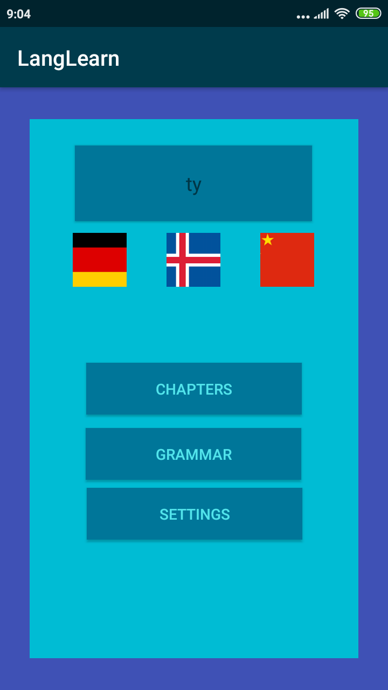
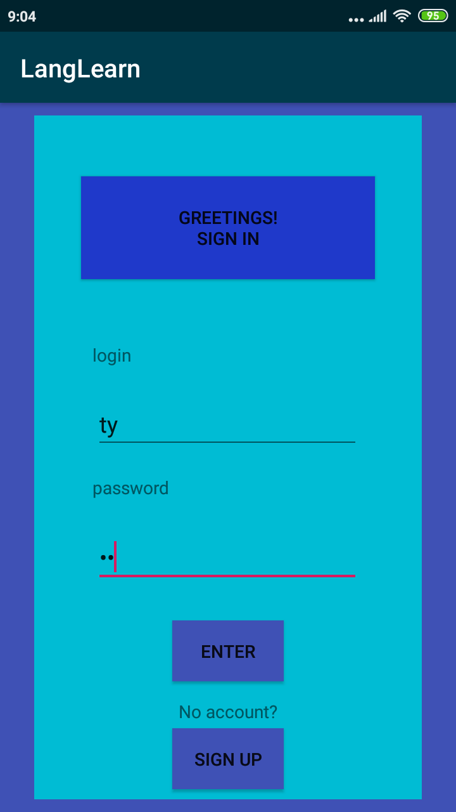
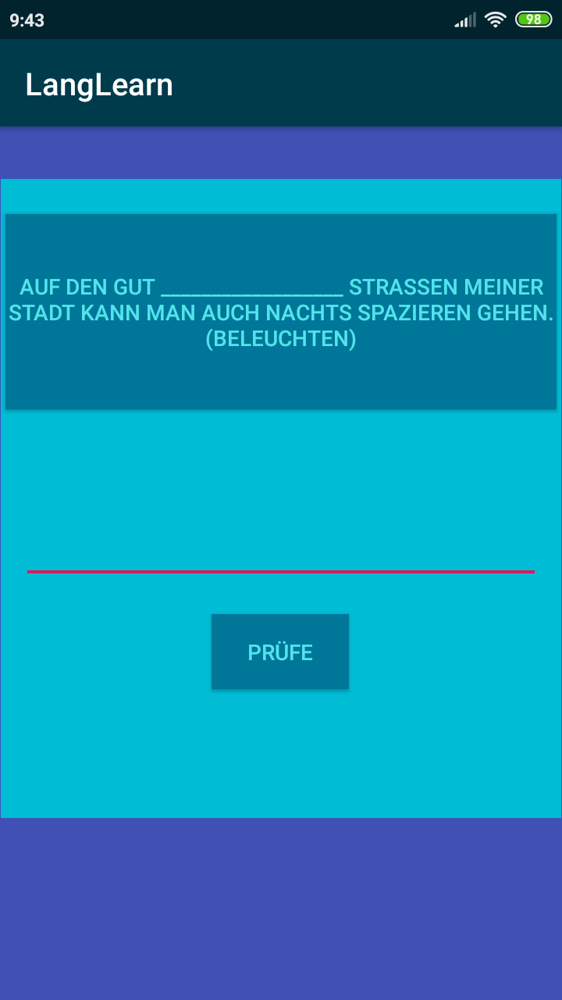

# LangLearn
This aplication is made with the purpose of teaching a language through test and grammatical exercises
In order to use it you need to create an account and sign in
Then in the main menu you choose a language through clicking on one of the flags displayed, currently only german has questions added
Once chosen you can go through tests or grammatical exercises

  
  

 

  
  

